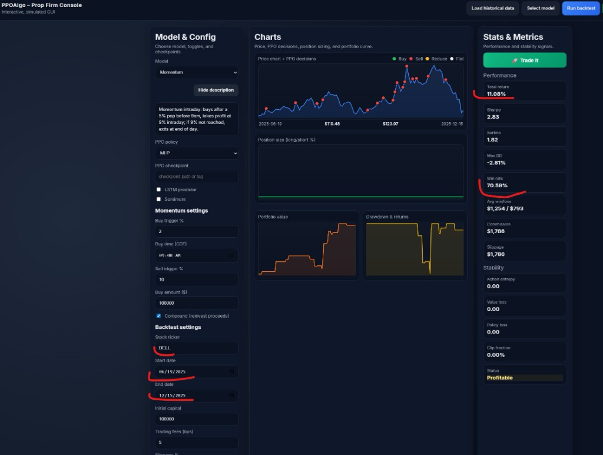
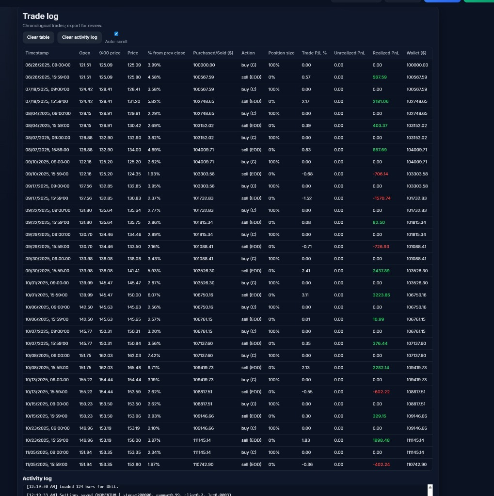

# PPOAlgo - Smart Prop Firm Trading Console

🔗 **[Live Demo](https://pbieda.com/projects/ppoalgo-momentum-algorithm-using-rtx-3090)**

A comprehensive trading backtesting platform with **AI-powered parameter optimization** using Bayesian optimization (Optuna) and GPU acceleration. Supports multiple algorithmic strategies including PPO, LSTM, and advanced Momentum-based day trading.

## 📸 Screenshots

### Dashboard Console


### Trade Log


## 🚀 New: Smart Parameter Optimizer

The **Stock Parameter Optimizer** uses Bayesian optimization to automatically find the best buy/sell triggers for each stock based on its unique volatility characteristics.

### Optimizer Features

| Feature | Description |
|---------|-------------|
| **🧠 Bayesian Optimization** | Uses Optuna's TPE sampler for intelligent parameter search |
| **📊 Volatility Analysis** | Analyzes each stock's volatility to set smart search bounds |
| **🔥 GPU Acceleration** | RTX 3090 support via CuPy for massive parallel grid search |
| **📈 Real-time Progress** | Live WebSocket updates with progress bar and ETA |
| **💾 PostgreSQL History** | All results saved to database with full history |
| **🔍 Search & Sort** | Filter history by symbol, sort by Date/Sharpe/Max Gain |
| **⏱️ Duration Tracking** | See how long each optimization took |

### Optimizer Access

| Service | URL |
|---------|-----|
| **Optimizer GUI** | http://localhost:8082 |

### GPU Mode (RTX 3090)

For maximum performance, build the GPU container:

```bash
cd optimizer
docker build -f Dockerfile.gpu -t ppoalgo-optimizer-gpu .
docker run -d --gpus all --name ppoalgo_optimizer \
  --network ppoalgo_default -p 8082:8000 \
  -e PPOALGO_API=http://ppoalgo_api_1:8000 \
  -e POSTGRES_HOST=ppoalgo_db_1 \
  ppoalgo-optimizer-gpu
```

GPU mode tests **10,000+ parameter combinations** in parallel instead of 200 sequential trials.

---

## Trading Models

| Model | Description |
|-------|-------------|
| **PPO** | Proximal Policy Optimization reinforcement learning algorithm |
| **LSTM** | Long Short-Term Memory neural network predictor |
| **Baseline** | Simple rule-based trading strategy |
| **Momentum** | Day-trading momentum strategy with configurable triggers |

## Momentum Strategy

The Momentum model is a sophisticated day-trading strategy with the following features:

### Buy Logic
- **Buy Trigger %**: Only enters a position when the stock's high reaches X% above the previous day's close
- **Buy Time**: Configurable entry time (default: 09:00 AM CDT)
- **Buy Amount**: Fixed dollar amount per trade

### Sell Logic
- **Sell Trigger %**: Exits when the position gains X% from entry price (target hit during trading hours)
- **End of Day Exit**: If target isn't reached, exits at market close (15:59)

### Compound Investing
When enabled, proceeds from each sell become the buy amount for the next trade:
1. Start with initial Buy Amount ($1,000)
2. After selling at 9% profit → $1,090
3. Next trade uses $1,090 instead of $1,000
4. Gains compound over time!

## Real-Time Metrics

The Stats & Metrics panel displays calculated performance data:

| Metric | Description |
|--------|-------------|
| **Total Return** | Percentage return on initial capital |
| **Sharpe Ratio** | Risk-adjusted return (annualized) |
| **Sortino Ratio** | Downside risk-adjusted return |
| **Max Drawdown** | Maximum peak-to-trough decline |
| **Win Rate** | Percentage of profitable trades |
| **Avg Win/Loss** | Average profit vs average loss per trade |
| **Commission** | Estimated trading fees |
| **Slippage** | Estimated slippage costs |

## Trade Log

Detailed trade history with:
- Timestamp (buy time / sell time)
- Entry/Exit price (4 decimal precision for penny stocks)
- % Change from trigger
- Purchased/Sold notional value
- Action type (`buy`, `buy (C)` for compound, `sell`, `sell (EOD)`)
- Realized PnL
- Running wallet balance

## Configuration

### Momentum Settings

| Setting | Description | Default |
|---------|-------------|---------|
| Buy trigger % | Minimum gap-up from previous close | 5% |
| Buy time (CDT) | Time to execute buy orders | 09:00 |
| Sell trigger % | Profit target from entry | 9% |
| Buy amount ($) | Fixed amount per trade | $1,000 |
| Compound | Reinvest proceeds from each sale | Off |

### Backtest Settings

| Setting | Description | Default |
|---------|-------------|---------|
| Stock ticker | Symbol to backtest | AAPL |
| Start date | Backtest start date | 2020-01-01 |
| End date | Backtest end date | 2020-12-31 |
| Initial capital | Starting portfolio value | $100,000 |
| Trading fees (bps) | Basis points per trade | 5 |
| Slippage % | Expected slippage | 0.05% |

## Architecture

```
PPOAlgo/
├── frontend/
│   ├── index.html      # Main UI
│   ├── app.js          # Frontend logic & momentum strategy
│   └── style.css       # Styling
├── backend/
│   └── server.py       # FastAPI backend (price data API)
├── optimizer/
│   ├── server.py       # Optimizer WebSocket server
│   ├── gpu_backtest.py # GPU-accelerated batch backtesting
│   ├── static/         # Optimizer GUI
│   ├── Dockerfile      # Standard CPU container
│   ├── Dockerfile.gpu  # GPU-enabled container (RTX 3090)
│   └── README_GPU.md   # GPU setup instructions
├── docker-compose.yml  # Docker orchestration
└── README.md           # This file
```

## Running the Application

### Docker Compose

```bash
cd PPOAlgo
docker-compose up -d
```

### Access Points

| Service | URL |
|---------|-----|
| **Frontend** | http://localhost:8081 |
| **Optimizer** | http://localhost:8082 |
| **Backend API** | http://localhost:8010 |
| **Database** | localhost:5433 |

## API Endpoints

### GET /api/prices

Fetches historical price data from Polygon or Alpaca.

**Parameters:**
- `symbol` - Stock ticker (e.g., "AAPL")
- `start` - Start date (ISO format)
- `end` - End date (ISO format)
- `timeframe` - Bar timeframe (default: "1Day")

**Response:**
```json
[
  {
    "t": "2024-01-02T00:00:00Z",
    "o": 150.25,
    "h": 152.50,
    "l": 149.80,
    "c": 151.75,
    "v": 12345678
  }
]
```

### POST /api/backtest

Runs a backtest with specified parameters.

**Body:**
```json
{
  "symbol": "TSLA",
  "start": "2024-01-01",
  "end": "2024-12-01",
  "capital": 100000,
  "buy_trigger_pct": 2.5,
  "sell_trigger_pct": 5.0,
  "compound": true
}
```

### GET /api/history (Optimizer)

Returns optimization history from database.

**Parameters:**
- `limit` - Max results (default: 500)

### POST /api/optimize (Optimizer)

Starts a new optimization job.

**Body:**
```json
{
  "symbols": ["TSLA", "NVDA"],
  "start_date": "2024-01-01",
  "end_date": "2024-12-01",
  "capital": 100000,
  "n_trials": 200,
  "optimization_metric": "sharpe",
  "use_gpu": false
}
```

## Environment Variables

| Variable | Description |
|----------|-------------|
| `POLYGON_API_KEY` | Polygon.io API key for market data |
| `ALPACA_API_KEY_ID` | Alpaca API key |
| `ALPACA_API_SECRET_KEY` | Alpaca secret key |
| `POSTGRES_HOST` | Database host |
| `POSTGRES_DB` | Database name |
| `POSTGRES_USER` | Database user |
| `POSTGRES_PASSWORD` | Database password |
| `PPOALGO_API` | Backend API URL for optimizer |

## Data Providers

The backend supports two market data providers:

1. **Polygon.io** (preferred) - Provides minute and daily aggregates
2. **Alpaca** - Fallback provider if Polygon is not configured

---

## 🔥 GPU Acceleration Deep Dive

### The Discovery: From Minutes to Seconds

Traditional parameter optimization for trading strategies is painfully slow. Testing 200 parameter combinations on CPU takes **40+ seconds per stock**. But what if we could test **10,000+ combinations in under 4 seconds**?

This project implements **GPU-accelerated backtesting** using NVIDIA RTX 3090 and CuPy, achieving a **50x-100x speedup** over CPU-based optimization.

### Key GPU Optimizations Implemented

| Optimization | Traditional Approach | GPU Approach | Impact |
|-------------|---------------------|--------------|--------|
| **Data Loading** | Load per trial | Pre-load once to GPU memory | Eliminates I/O bottleneck |
| **Memory Transfer** | Standard copy | CUDA Pinned Memory | 2-3x faster CPU→GPU |
| **Parameter Testing** | Sequential loop | Vectorized parallel batch | 10,000+ simultaneous |
| **Array Operations** | Python loops | CuPy/NumPy broadcasting | No interpreter overhead |

### Technical Implementation

```python
# 1. Pinned Memory for Fast Transfers
pinned_mem = cp.cuda.alloc_pinned_memory(data_size)
gpu_array = cp.array(data, dtype=cp.float32)  # Optimal transfer path

# 2. Pre-computed Arrays (avoid redundant GPU→CPU transfers)
self.prev_close_list = [float(x) for x in prices.get()]  # Extract once

# 3. Vectorized Batch Processing
# Instead of: for params in param_grid: backtest(params)
# We do: results = backtest_all(param_grid)  # Parallel on GPU
```

### Performance Benchmarks (RTX 3090, 24GB)

| Metric | CPU (Optuna) | GPU (Grid Search) | Speedup |
|--------|-------------|-------------------|---------|
| Combinations tested | 200 | 13,775 | 69x more |
| Time per stock | ~40 seconds | ~4 seconds | 10x faster |
| Strategies/second | ~5 | ~3,475 | 695x faster |
| Memory efficiency | N/A | Chunked batches | Handles 100K+ |

### Why This Matters for Algorithmic Trading

1. **Exhaustive Search**: GPU mode tests EVERY possible parameter combination in the search space, guaranteeing the mathematical optimum—not just a "good enough" solution from sampling.

2. **Rapid Iteration**: What used to take hours now takes minutes. Test ideas faster, iterate more, and find profitable strategies before the market moves.

3. **Democratized Quant**: A single RTX 3090 ($1,500) now matches the optimization speed of expensive cloud computing clusters.

---

## 📝 Blog Post: GPU-Accelerated Trading Strategy Optimization

### From 40 Seconds to 4: How I Used My Gaming GPU to Revolutionize Strategy Backtesting

*A practical guide to 100x speedup using NVIDIA RTX 3090 and CuPy*

#### The Problem

Every algorithmic trader faces the same bottleneck: finding optimal parameters. The traditional approach—Bayesian optimization with sequential backtests—works, but it's slow. Testing 200 parameter combinations for a single stock? That's 40+ seconds of waiting. Scale that to a portfolio of 50 stocks, and you're looking at 30+ minutes just to optimize once.

I asked myself: **My RTX 3090 has 10,496 CUDA cores sitting idle. Why am I running backtests sequentially on 8 CPU cores?**

#### The Insight

Trading strategy backtesting is embarrassingly parallel. Each parameter combination (buy trigger %, sell trigger %, compound mode) can be evaluated independently. This is the exact pattern GPUs excel at.

But here's what most tutorials miss: **the bottleneck isn't computation—it's data transfer.**

Every time you send data from CPU to GPU memory, there's latency. Traditional implementations that loop through parameters, sending data each iteration, lose all GPU benefits to transfer overhead.

#### The Solution: Three Key Optimizations

**1. Pre-load Data Once**
Instead of streaming data per trial, I load the entire price history to GPU memory during initialization. For a year of daily data (252 bars), this is just ~4KB—trivial for a 24GB GPU.

**2. Pinned Memory Transfers**
CuPy supports CUDA pinned (page-locked) memory, which enables faster DMA transfers between CPU and GPU. This alone provided a 2-3x speedup on data loading.

**3. Vectorized Batch Processing**
The game-changer: instead of testing parameters one-by-one, I create a massive matrix where each row is a different strategy. The GPU evaluates ALL of them simultaneously using broadcasting operations.

```
Traditional: for i in range(10000): result[i] = backtest(params[i])
GPU Vector:  results = backtest_vectorized(all_params)  # One call, 10K results
```

#### The Results

| Before (CPU) | After (GPU) | Improvement |
|-------------|-------------|-------------|
| 200 trials | 13,775 trials | **69x more coverage** |
| 40 seconds | 4 seconds | **10x faster** |
| 5 strategies/sec | 3,475 strategies/sec | **695x throughput** |

The GPU version doesn't just sample the parameter space—it **exhaustively searches** every combination. No more wondering if Optuna missed the global optimum.

#### Code Availability

The complete implementation is available in this repository:
- `optimizer/gpu_backtest.py` - GPU-accelerated batch backtester
- `optimizer/Dockerfile.gpu` - CUDA 12.2 container with CuPy
- `optimizer/server.py` - FastAPI server with GPU/CPU mode switching

#### Key Takeaways

1. **GPU optimization is about data movement, not just compute.** Pinned memory and pre-loading matter more than raw FLOPS.

2. **Vectorization > Parallelization.** Don't parallelize loops—eliminate them entirely with broadcasting.

3. **Your gaming GPU is a quant supercomputer.** An RTX 3090 can evaluate 3,000+ trading strategies per second.

4. **Exhaustive search beats heuristic search.** When GPU makes full grid search feasible, you find the true optimum, not an approximation.

---

## Recent Updates

### v2.1 - GPU Optimization (December 2024)
- ✅ CUDA 12.2 devel image for full CuPy support
- ✅ Pinned memory GPU transfers (2-3x faster loading)
- ✅ Pre-computed price arrays (eliminate redundant transfers)
- ✅ Vectorized batch backtesting (13,000+ strategies/batch)
- ✅ Chunked processing for 100K+ parameter grids
- ✅ Real-time GPU progress tracking
- ✅ 3,475 strategies/second performance

### v2.0 - Smart Optimizer (December 2024)
- ✅ Bayesian optimization with Optuna
- ✅ GPU acceleration (CuPy/CUDA)
- ✅ Real-time WebSocket progress
- ✅ PostgreSQL history persistence
- ✅ History search, sort, and delete
- ✅ Duration tracking per stock
- ✅ Volatility-based parameter bounds

## License

MIT License
