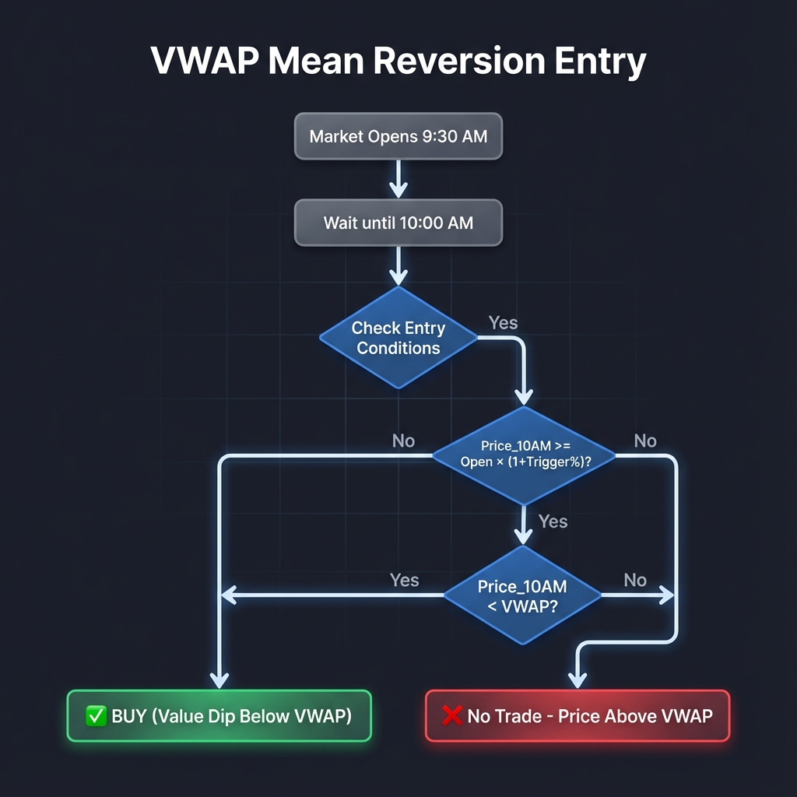
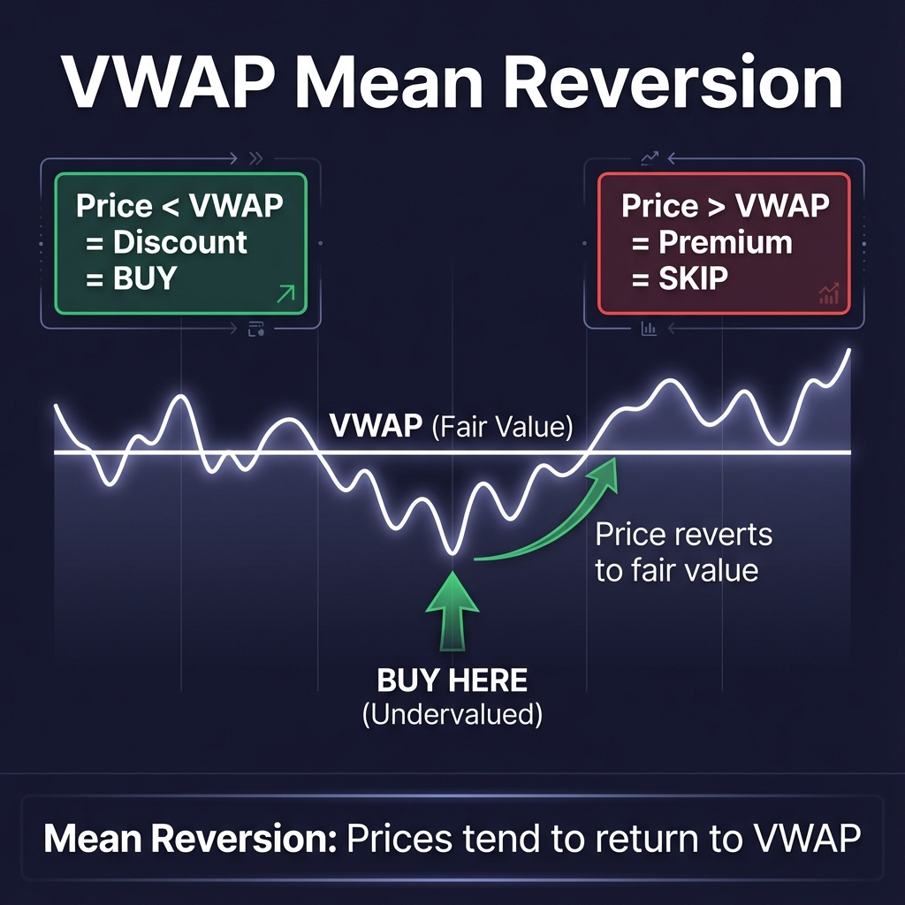
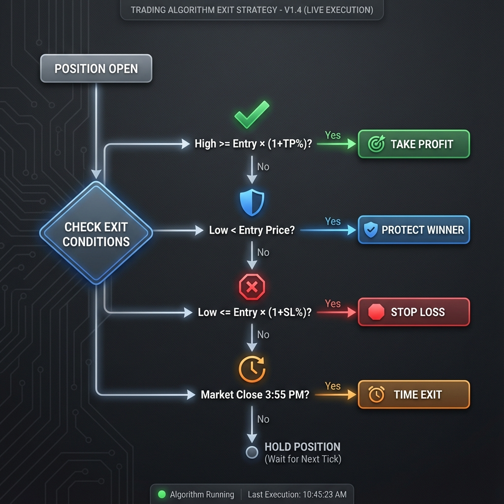

# Momentum 10am + VWAP (Mean Reversion)

## Strategy Overview

The **Momentum 10am + VWAP** strategy uses **mean reversion** - buying when price is BELOW VWAP (undervalued) with momentum confirmation.

---

## Entry Decision Flow



**Entry Conditions (ALL must be true):**
1. ✅ Price at 10AM >= Open × (1 + Buy Trigger %)
2. ✅ Price at 10AM **< VWAP** (value dip)

---

## Why Mean Reversion Works



**The Logic:**
- Most algos buy when price > VWAP (crowded trade)
- We buy when price **< VWAP** (contrarian edge)
- VWAP = fair value → below VWAP = temporary discount
- Price tends to **revert back** to VWAP

| Price vs VWAP | Traditional Algos | Our Strategy |
|---------------|-------------------|--------------|
| Price > VWAP | ✅ Buy (strength) | ❌ Skip (overvalued) |
| Price < VWAP | ❌ Skip (weakness) | ✅ Buy (value dip) |

---

## Exit Decision Flow



**Exit Priority Order:**

| Priority | Exit Type | Condition |
|----------|-----------|-----------|
| 1️⃣ | **Take Profit** | High >= Entry × (1 + TP%) |
| 2️⃣ | **Protect Winner** | Low < Entry Price |
| 3️⃣ | **Stop Loss** | Low <= Entry × (1 + SL%) |
| 4️⃣ | **Time Exit** | 3:55 PM reached |

---

## Parameters

| Parameter | Description | Typical Range |
|-----------|-------------|---------------|
| **Buy Trigger** | Min % up at 10AM | 0.5% - 3% |
| **Take Profit** | Profit target | 5% - 15% |
| **Stop Loss** | Max loss | 0.5% - 2% |

---

## Example Trade

```
Open: $100.00
10AM Price: $101.50 (+1.5%)
VWAP: $102.00

Check conditions:
  1. $101.50 >= $100 × 1.02? ✅ (meets 2% trigger)
  2. $101.50 < $102.00? ✅ (below VWAP = value dip)

→ BUY at $101.50 (discount to fair value)
→ Expect price to revert UP toward VWAP $102
```

---

## Key Advantages

| Benefit | Why |
|---------|-----|
| **Contrarian Edge** | Buy when others are selling |
| **Better Entry** | Lower price = more upside |
| **VWAP as Target** | Natural reversion level |
| **Less Crowded** | Opposite of institutional algos |

---

*Last updated: December 2025*
